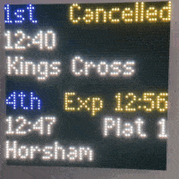

# ESP32 Matrix Rail Departure Board

Display departing services from any rail station within Great Britain on a 64x64 RGB LED Matrix using data from National Rail



## Overview
* Designed to emulate the feel of real departure boards using a familiar layout and a custom font
* Pulls data from National Rail's Darwin data feeds
* Multiple services can be displayed and the amount is user definable. 
    * The first service remains pinned to the top half of the matrix with the remaining services fading in and out sequentially on the bottom half of the matrix

## Hardware Requirements
1. 64x64 HUB75 RGB LED Matrix such as [this one from Pimoroni](https://shop.pimoroni.com/products/rgb-led-matrix-panel?variant=3029531983882)
2. ESP32 Controller board that supports [mrfaptastic's library](https://github.com/mrfaptastic/ESP32-HUB75-MatrixPanel-DMA). Such as [witnessmenow's ESP32-Trinity](https://github.com/witnessmenow/ESP32-Trinity).
3. A suitable 5V power supply. Refer to the documentation of your controller board

## Token
A token is required to access the data feeds. To get the token:
1. Vist: https://www.nationalrail.co.uk/100296.aspx
2. Scroll down to the Darwin Data Feeds table. Find the row labelled "LDB Webservice (PV)" and click register here 
3. Follow the registration steps
4. Wait for a bit and you should get an email confirming your account is activated. The email also contains your token

## Setup
* Compiled with Arduino IDE 1.8.19 and [ESP32 Arduino-core v2.05](https://github.com/espressif/arduino-esp32)
* Required Libraries: [Adafruit_GFX v1.10.2](https://github.com/adafruit/Adafruit-GFX-Library) and [ESP32 HUB75 LED Matrix Panel DMA Display v2.0.7](https://github.com/mrfaptastic/ESP32-HUB75-MatrixPanel-DMA)
* Modify the following options within ```ESP32-MatrixRailDepartureBoard.ino```:
    * ```WIFI_SSID```, ```WIFI_PASSWORD```, ```NATIONAL_RAIL_TOKEN```, ```NATIONAL_RAIL_CRS``` and ```NATIONAL_RAIL_ROWS```
    * ```mxconfig``` to match your matrix and controller setup.

## Acknowledgements
* Uses [TinyXML2](https://github.com/leethomason/tinyxml2) to parse XML data returned by National Rail